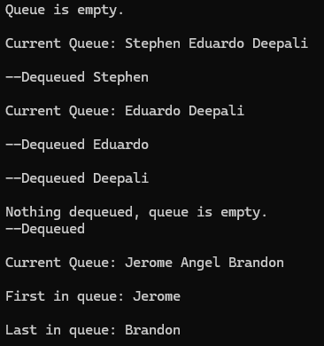

You are developing a program to manage a call queue of customers using the Queue  in C#. 
The program creates a queue of callers and demonstrates the functionality of enqueueing elements 
into the queue and iterating over the elements and dequeuing.

Use linked lists. 

---
### Code Output:

